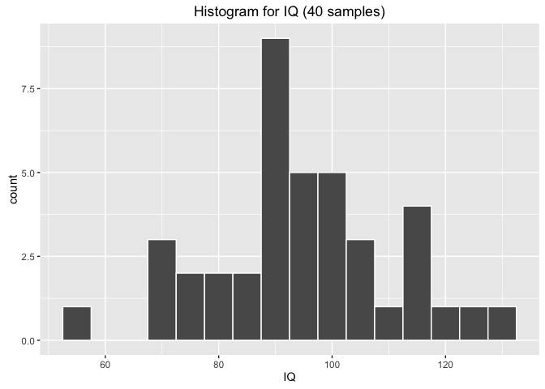
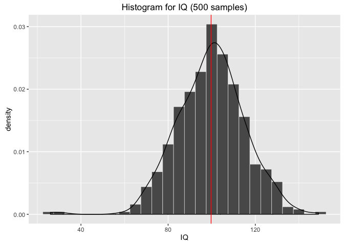
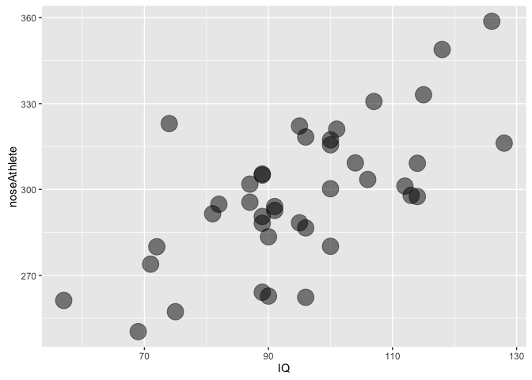
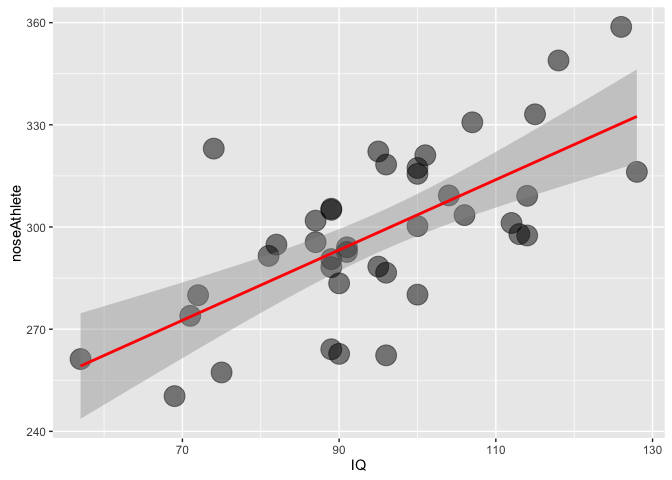

Basic Stats
================
jeff macinnes
January 24, 2017


-   [The Data](#the-data)
-   [Descriptive Statistics](#descriptive-statistics)
    -   [Quick data summary](#quick-data-summary)
    -   [Plotting raw data](#plotting-raw-data)
    -   [Normal Distributions](#normal-distributions)
-   [Inferential Statistics](#inferential-statistics)
    -   [Hypothesis testing](#hypothesis-testing)
    -   [Interpreting results](#interpreting-results)
-   [Basic Analyses](#basic-analyses)
    -   [Correlation](#correlation)
    -   [Multiple Regression](#multiple-regression)

The goal here is to provide an overview on some basic statistical approaches that you can use in analyzing your AVB eye-tracking data. We'll cover the ideas behind these approaches -- identifying dependent/independent variables, deciding on appropriate analyses, interpretting results -- as well as the tools to run these analyses yourself. We'll be using [RStudio](https://www.rstudio.com/products/rstudio/download/), so if you haven't already download and install both [R](https://cran.r-project.org/) and [RStudio](https://www.rstudio.com/products/rstudio/download/).

The Data
========

In order to have some data to play with, there is a simulated datafile in `data/exampleData.tsv`

This dataset has 40 subjects. For each subject we have values for IQ, and fixation time on the nose of various image categories. So we have:

-   Dependent Variables (DV):
    -   **IQ**: subject IQ score
    -   **noseDwellTime**: time spent fixating on the nose

And we measured **noseDwellTime** across 3 different image categories. So, one independent variable (IV) with 3 levels

-   Independent Variable levels:
    -   **movie**: faces of movie stars
    -   **athlete**: faces of athletes
    -   **nobel**: faces of Nobel laureates

So, let's load the dataset:

``` r
# if you haven't already, set your working directory to 'stats_intro'
#setwd("<dirPath>/stats_intro")

# read the data, store in variable called 'dt'
dt <- read.csv('data/exampleData.tsv', sep='\t', row.names=1)

# print the first few rows
head(dt, n=5)
```

    ##            IQ noseMovie noseAthlete noseNobel
    ## subject_1 100    199.78      317.33    415.08
    ## subject_2  57    228.94      261.23    368.76
    ## subject_3  96    316.19      262.32    382.98
    ## subject_4  82    232.23      294.83    328.46
    ## subject_5  89    277.99      288.21    307.44

You can see all of our variables. Each subject has an IQ score and average noseDwellTimes for Movie stars, Athletes, and Nobel.

Notice that our table has one row per subject, and multiple *observations* for each subject in different columns. When the table is organized like this, it is referred to as *wide-format*

To access specific columns of your data, use the following format:

``` r
# <tableName>$<columnName>
dt$IQ
```

    ##  [1] 100  57  96  82  89 114 118 106  87  90 112  89 100 114  96 107  89
    ## [18] 101  87  75  91 113  89  90  91 104 126 100  71  74  69  95  95  96
    ## [35] 115  81 128  89  72 100

Descriptive Statistics
======================

Descriptive statistics are ways to summarize *your data*. That is, they don't infer any conclusions from your data to the larger population from which your subjects are drawn from (you'll need **inferential statistics** for that...don't worry, it's coming). Descriptive statistics can be things like the *mean*, *mode*, and *median* of a variable.

### Quick data summary

Let's get some basic descriptive stats on this dataset.

``` r
# if you need to install the psych library:
# install.packages("psych", dependencies=TRUE)
library(psych)  # this is an external library that has some really useful tools within it

# the 'describe' function comes with the psych library and will report descriptive stats on all vars in your table
describe(dt)
```

    ##             vars  n   mean    sd median trimmed   mad    min    max  range
    ## IQ             1 40  94.95 15.71  95.00   95.06 11.86  57.00 128.00  71.00
    ## noseMovie      2 40 249.81 26.58 250.50  249.33 31.50 199.78 316.19 116.41
    ## noseAthlete    3 40 298.36 24.30 297.72  297.86 23.60 250.35 358.75 108.40
    ## noseNobel      4 40 342.80 46.71 342.10  342.65 54.63 234.73 431.02 196.29
    ##              skew kurtosis   se
    ## IQ          -0.04    -0.27 2.48
    ## noseMovie    0.22    -0.68 4.20
    ## noseAthlete  0.17    -0.18 3.84
    ## noseNobel   -0.07    -0.48 7.38

You can see, for instance, that subjects spent an average of **249.81** ms looking at the noses of movie stars, and **342.80** ms looking at the noses of Nobel laureates. In this sample, participants spent longer (on average) looking at the noses of Nobel winners than movie stars. But that's all you can say. You cannot generalize that conclusion to the population at large.

### Plotting raw data

It's often useful to plot your raw data to give you a better look at it. For one-dimensional data (e.g. subject IQ scores), a histogram can be a useful way to visualize your data

``` r
# if you need to install the ggplot library:
# install.packages("ggplot2", dependencies=TRUE)
library(ggplot2)  # useful plotting library

qplot(IQ, data=dt, 
      binwidth=5,
      main="Histogram for IQ (40 samples)",
      col=I("white"))
```



This shows the number of particpants (y-axis) whose IQ was within a certain IQ range (x-axis). Try plotting the distributions of other variables. By looking at the histogram, you can get a quick sense of whether a given variable is **normally distributed**. Many of the statistical tests described below rely and assume on data points being normally distributed. So what's that mean?

### Normal Distributions

If a variable is **normally distributed**, its histogram will take on a bell-shaped curve. Most of the data points will be clustered around the mean, i.e. the **count** (i.e. y-axis) will have the greatest value near the mean. As you move outward toward the tails in either direction, the counts will drop off symmetrically. This means you have ever fewer datapoints at extreme values along the x-axis.

Let's look at our IQ scores again. Above, we plotted the histogram of IQ scores in our sample of 40 subjects. Let's plot the histogram of IQ scores from a larger population, say 500 subjects.

``` r
# read in larger population datatable
dt_pop <- read.csv('data/exampleData_population.tsv', sep='\t', row.names=1)


# plot the histogram for IQ scores from larger population
ggplot(dt_pop, aes(x=IQ, y=..density..)) + 
  geom_histogram(binwidth=5, size=.2, col="white") + 
  geom_density(colour="black") +
  geom_vline(xintercept=mean(dt_pop$IQ), color="red") +
  ggtitle("Histogram for IQ (500 samples)")
```



With 500 datapoints it becomes easier to see that IQ scores appear normally distributed. IQ scores are clustered symmetrically about the mean (shown as vertical red line). Offically, for a distribution to be considered **normal**:

-   **68%** of datapoints must fall within +/- 1 standard deviation of the mean
-   **95.5%** of datapoints must fall within +/- 2 standard deviations of the mean
-   the remaining **4.5%** of datapoints are in the tails (**~2.3%** in each tail)

Simply saying a distribution *looks* normal isn't enough. Ideally, we'd like to be able to *quantify* our evidence for making that claim. Testing whether a distribution is normal or not is a good segue into talking about **inferential statistics**.

Inferential Statistics
======================

Inferential statistics are used to *infer* aspects about a population based on the *sample* of data you measured. You want to know if people are taller in Durham vs. Chapel Hill? You collect a random sample of 200 individuals from both locations, measure their heights, and come up with an average height of individuals from Durham and an average height of individuals from Chapel Hill. Say you measure that Durhamites are 3cm taller. Is this a **true** difference, or just a result of the individuals you happened to sample? If you sampled 200 *different* people, how likely would you be to get the same response? This is where **inferential statistics** come into play.

**So... are the IQ scores from our sample normally distributed or not?**

Here's the plot again


The Shapiro-Wilk normality test is a way of testing how liklely it is your observed data came from a normal distribution

``` r
shapiro.test(dt$IQ)
```

    ## 
    ##  Shapiro-Wilk normality test
    ## 
    ## data:  dt$IQ
    ## W = 0.98255, p-value = 0.7827

This test, like many of the statistical tests covered below, returns a **p-value**. Knowing how to interpret a p-value is critical to understanding your results, and crucially, the limitations of your conclusions. To interpret a p-value, you need to be familiar with the idea of hypothesis testing.

### Hypothesis testing

With inferential statistics, the **true** state of the world is unknown. You don't know the **true** average height of everyone in Durham (unless you were to measure everyone, in which case you don't need stats). What you are left with is **probabilities**. How likely is it that my observations *reflect* the true state of the world?

If we're thinking about our normal distribution question above, we have two possibilities. Or let's call them *hypotheses*:

-   **hypothesis 1:** the data **really are** normally distributed
-   **hypothesis 2:** the data **really are *not* ** normally distributed

You can either conclude that hypothesis 1 is correct, or conclude that hypothesis 2 is correct. So, there are 4 possible outcomes:

|                          |      **truth:** normal     |       **truth:** not normal|
|--------------------------|:--------------------------:|---------------------------:|
| **conclude: normal**     |           correct          |  incorrect (false positive)|
| **conclude: not normal** | incorrect (false negative) |                     correct|

To set up a hypothesis test, we define one of our hypothesis as the **null** hypothesis (called **H<sub>o</sub>**) and the other the **alternative** hypothesis (**H<sub>A</sub>**). In the case of the Shapiro-Wilk normality test, we have:

-   **H<sub>o</sub>**: Our IQ scores came from a normally distributed population
-   **H<sub>A</sub>**: Our IQ scores did not come from a normally distributed population

So our null hypothesis is that our data indeed came from a normally distributed population. Remember, we don't have any way of knowing if this is **actually** true or not. Instead, we say "assuming the data **DID** come from a normally distributed population, how probable is it that we would have gotten our observed data through random sampling?" This probability is reflected in the **p-value**.

When we run a hypothesis test we are asking whether we are going to **reject** or **fail to reject** the null hypothesis based on the strength of the p-value. So we also need to set up a p-value threshold that will allow us to make that decision. This is often set at p &lt; 0.05; or, in other words, we are willing to **reject** the null hypothesis if, assuming the null hypothesis **is** true, there's less than a 5% chance we would have observed our results in a random sample.

So let's return to the Shapiro-Wilk normality test on our IQ sample

``` r
shapiro.test(dt$IQ)
```

    ## 
    ##  Shapiro-Wilk normality test
    ## 
    ## data:  dt$IQ
    ## W = 0.98255, p-value = 0.7827

The Shapiro-Wilk normality test returned a p-value of **~.78**. That means there is a 78% chance we would see data that looks like our sample, assuming the null hypothesis **H<sub>o</sub>** is true. **.78** &gt; **.05**, thus we **fail to reject** the null hypothesis that our data came from a normal distribution.

**NOTE:** this is **not** the same as saying "therefore our data came from a normal distribution." All hypothesis testing of this sort allows us to say is "based upon the strength of our evidence, we cannot reasonably rule out the possibility that our data came from a normal distribution."

**So...is our data normally distributed or not?**

No way of knowing! BUT -- at least we can move forward knowing that there isn't strong evidence suggesting that our data did **not** come from a normal distribution.

### Interpreting results

The Shapiro-Wilk example was chosen to illustrate these ideas because, unlike other statistical tests discussed later, large p-values are usually what you're hoping for -- you typically hope there isn't large evidence suggesting your data isn't normal. All statistical tests involve null hypotheses, and how you define the null hypothesis determines how you will interpret your results. If we were doing hypothesis testing on our sample of the average heights of individuals from Durham vs. Chapel Hill, and measured a difference of 7cm between the cities, we might set up our hypotheses as:

-   **H<sub>o</sub>**: There is no difference in average height between Durham and Chapel Hill
-   **H<sub>A</sub>**: There is a difference in average height between Durham and Chapel Hill

In that case, if we ran a t-test (covered below) and got a p-value of 0.04, this would mean: assuming there was **no difference** in the average height, there would be a 4% chance we would have observed a difference of 7cm. Since this is below our p-threshold of 5%, we would be justified in **rejecting the null hypothesis**. And again, this does not mean that a true difference exists. Just that you failed to find compelling evidence that a difference **didn't** exist. *Not Guilty* does not mean *Innocent*.

Basic Analyses
==============

Here are some of the basic analyses that may be useful for your AVB eye-tracking analysis. For each, we'll describe an example use-case and how to format your data and run the analysis in R.

First off, think about what your goal is. Are you trying to:

-   Examine **relationships** between variables:
    -   2 variables: [correlation](#correlation)
    -   predict DV based on 2 or more variables: **multiple regression**
-   Compare **means** between:
    -   one group vs. set value: **one-sample t-test**
    -   two groups, same subjects: **paired-samples t-test**
    -   two groups, different subjects: **independent samples t-test**
    -   2 groups, one IV, same subjects: **repeated measures ANOVA**

    -   2 groups, one IV, different subjecst: **one-way ANOVA**

Correlation
-----------

Basic correlations are a measure of the relationship between two variables. A correlation will tell you the strength and direction of this relationship. A positive correlation means that as one variable increases, the other tends to increase as well; a negative correlation means that as one variable increases, the other variable tends to decrease.

For instance, in our sample dataset, say you were interested in knowing whether IQ scores predict fixation time on the noses of images of athletes. The two variables you'd select from the dataset are:

-   IQ
-   noseAthlete

To run the correlation in R:

``` r
# Compute the correlation coefficient, and determine if the relationship is significant
cor.test(dt$IQ, y=dt$noseAthlete)
```

    ## 
    ##  Pearson's product-moment correlation
    ## 
    ## data:  dt$IQ and dt$noseAthlete
    ## t = 5.5216, df = 38, p-value = 2.579e-06
    ## alternative hypothesis: true correlation is not equal to 0
    ## 95 percent confidence interval:
    ##  0.4490161 0.8102991
    ## sample estimates:
    ##       cor 
    ## 0.6672021

This provides you a lot of information. All the way at the bottom you have **cor**. This is the **correlation coeffcient**, ***r*** and tells you the direction and the strength of the correlation.

-   0 &lt; ***r*** &lt; 1: positive correlation
-   -1 &lt; ***r*** &lt; 0: negative correlation
-   |***r***| : strength of correlation

So a ***r*** of 0.66 represents a moderately strong *positive* correlation.

**Is this correlation significant?** Can we say that IQ significantly predicts fixation time on Athletes' noses? Our code also ran a hypothesis test behind the scenes. The hypotheses were:

-   **H<sub>o</sub>**: true correlation between variables is 0
-   **H<sub>a</sub>**: true correlation between variables is not 0

Find the p-value in the output table and interpret the result in the context of these hypotheses.

**Plotting the correlation:**

It often helps to plot the correlation to get a visual sense of how two variables may be related to each other. Here's the R code to plot the two variables we correlated above:

``` r
ggplot(dt, aes(x=IQ, y=noseAthlete)) +
  geom_point(size=7, alpha=.5)
```



We can see that indeed there does seem to be a positive relationship between the variables. Subject's with lower IQ scores also spent less time fixating on the nose's of athletes.

**Using one variable to predict the other**

In the next section we'll talk about using **multiple regression** to build a model to predict one variable based on a combination of 2+ seperate variables. This same idea can also be applied when you're working with just 2 variables. You can use **linear regression** to build a model that predicts one variable based on the value of a different variable. In our case, given this correlation we may be interested in building a model that predicts fixation time on athlete's nose based on IQ score.

``` r
# code for running a basic linear model in R
lmMod = lm(noseAthlete ~ IQ, data=dt)

summary(lmMod)
```

    ## 
    ## Call:
    ## lm(formula = noseAthlete ~ IQ, data = dt)
    ## 
    ## Residuals:
    ##     Min      1Q  Median      3Q     Max 
    ## -37.119 -13.337   0.023  12.911  46.288 
    ## 
    ## Coefficients:
    ##             Estimate Std. Error t value Pr(>|t|)    
    ## (Intercept) 200.3546    17.9837  11.141 1.56e-13 ***
    ## IQ            1.0321     0.1869   5.522 2.58e-06 ***
    ## ---
    ## Signif. codes:  0 '***' 0.001 '**' 0.01 '*' 0.05 '.' 0.1 ' ' 1
    ## 
    ## Residual standard error: 18.33 on 38 degrees of freedom
    ## Multiple R-squared:  0.4452, Adjusted R-squared:  0.4306 
    ## F-statistic: 30.49 on 1 and 38 DF,  p-value: 2.579e-06

This gives us a model for predicting noseAthlete based on IQ that takes the form

*y* = *m**x* + *b*

where *y* is noseAthlete, *x* is IQ score, *m* is the IQ coeffecient, and *b* is the intercept. Furthermore, this output tells us that IQ is a **significant** predictor of noseAthlete (find the associated p-value in the output table). Using this formula, we can predict the fixation time on athletes' nose for a *new* subject if we know his/her IQ score. For example, if the new subject's IQ score was **116** we could predict the average amount of time they would spend fixating on the nose of athletes as:

$$
\\begin{align}
y &= 1.032 \\cdot 116 + 200.3546\\\\
y &= {320.08}
\\end{align}
$$

$$\\sum\_{i=1}^{n} X^3\_i$$

This is just practice We'd predict noseAthlete to be ~320ms. Looking at the plot above, does this prediction seem reasonable?

Let's add this line to the plot, along with the confidence intervals

``` r
ggplot(dt, aes(x=IQ, y=noseAthlete)) +
  geom_point(size=7, alpha=.5) +
  geom_smooth(method=lm, color="red")
```



Multiple Regression
-------------------
