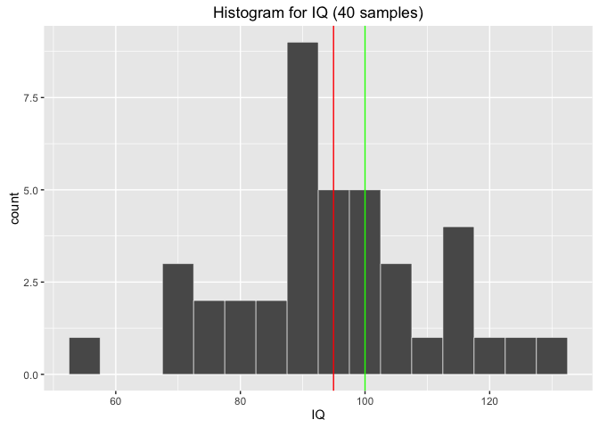
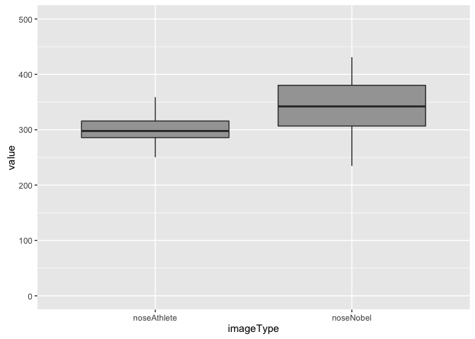
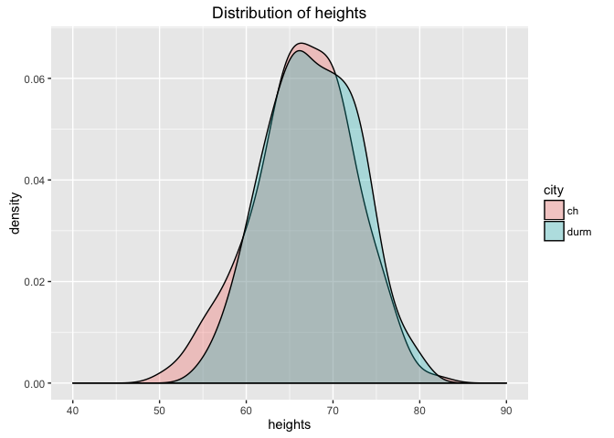
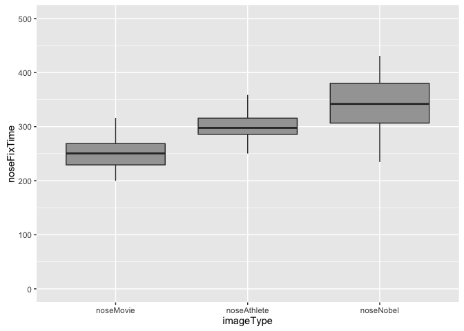
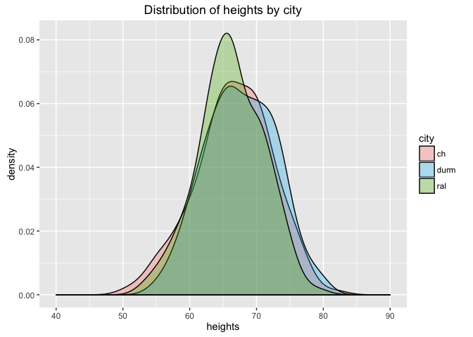
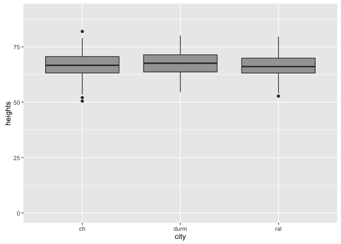

Basic Stats
================
January 27, 2017


-   [The Data](#the-data)
-   [Descriptive Statistics](#descriptive-statistics)
    -   [Quick data summary](#quick-data-summary)
    -   [Plotting raw data](#plotting-raw-data)
    -   [Normal Distributions](#normal-distributions)
-   [Inferential Statistics](#inferential-statistics)
    -   [Hypothesis testing](#hypothesis-testing)
    -   [Interpreting results](#interpreting-results)
-   [Basic Analyses](#basic-analyses)
    -   [Examine relationships](#examine-relationships)
        -   [Correlation](#correlation)
        -   [Multiple Regression](#multiple-regression)
    -   [Compare Means](#compare-means)
        -   [One-sample t-test](#one-sample-t-test)
        -   [Paired-samples t-test](#paired-samples-t-test)
        -   [Independent Samples t-test](#independent-samples-t-test)
        -   [Repeated measures ANOVA](#repeated-measures-anova)
        -   [One-way ANOVA](#one-way-anova)

The goal here is to provide an overview on some basic statistical approaches that you can use in analyzing your AVB eye-tracking data. We'll cover the ideas behind these approaches -- identifying dependent/independent variables, deciding on appropriate analyses, interpretting results -- as well as the tools to run these analyses yourself. We'll be using [RStudio](https://www.rstudio.com/products/rstudio/download/), so if you haven't already download and install both [R](https://cran.r-project.org/) and [RStudio](https://www.rstudio.com/products/rstudio/download/).

The Data
========

In order to have some data to play with, there is a simulated datafile in `data/exampleData.tsv`

This dataset has 40 subjects. For each subject we have values for IQ, and fixation time on the nose of various image categories. So we have:

-   Dependent Variables (DV):
    -   **IQ**: subject IQ score
    -   **noseDwellTime**: time spent fixating on the nose

And we measured **noseDwellTime** across 3 different image categories. So, one independent variable (IV) with 3 levels

-   Independent Variable levels:
    -   **movie**: faces of movie stars
    -   **athlete**: faces of athletes
    -   **nobel**: faces of Nobel laureates

So, let's load the dataset:

``` r
# if you haven't already, set your working directory to 'stats_intro'
#setwd("<dirPath>/stats_intro")

# read the data, store in variable called 'dt'
dt <- read.csv('data/exampleData.tsv', sep='\t', row.names=1)

# print the first few rows
head(dt, n=5)
```

    ##            IQ noseMovie noseAthlete noseNobel
    ## subject_1 100    199.78      317.33    415.08
    ## subject_2  57    228.94      261.23    368.76
    ## subject_3  96    316.19      262.32    382.98
    ## subject_4  82    232.23      294.83    328.46
    ## subject_5  89    277.99      288.21    307.44

You can see all of our variables. Each subject has an IQ score and average noseDwellTimes for Movie stars, Athletes, and Nobel.

Notice that our table has one row per subject, and multiple *observations* for each subject in different columns. When the table is organized like this, it is referred to as *wide-format*

To access specific columns of your data, use the following format:

``` r
# <tableName>$<columnName>
dt$IQ
```

    ##  [1] 100  57  96  82  89 114 118 106  87  90 112  89 100 114  96 107  89
    ## [18] 101  87  75  91 113  89  90  91 104 126 100  71  74  69  95  95  96
    ## [35] 115  81 128  89  72 100

Descriptive Statistics
======================

Descriptive statistics are ways to summarize *your data*. That is, they don't infer any conclusions from your data to the larger population from which your subjects are drawn from (you'll need **inferential statistics** for that...coming later). Descriptive statistics can be things like the *mean*, *mode*, and *median* of a variable.

### Quick data summary

Let's get some basic descriptive stats on this dataset.

``` r
# if you need to install the psych library:
# install.packages("psych", dependencies=TRUE)
library(psych)  # this is an external library that has some really useful tools within it

# the 'describe' function comes with the psych library and will report descriptive stats on all vars in your table
describe(dt)
```

    ##             vars  n   mean    sd median trimmed   mad    min    max  range
    ## IQ             1 40  94.95 15.71  95.00   95.06 11.86  57.00 128.00  71.00
    ## noseMovie      2 40 249.81 26.58 250.50  249.33 31.50 199.78 316.19 116.41
    ## noseAthlete    3 40 298.36 24.30 297.72  297.86 23.60 250.35 358.75 108.40
    ## noseNobel      4 40 342.80 46.71 342.10  342.65 54.63 234.73 431.02 196.29
    ##              skew kurtosis   se
    ## IQ          -0.04    -0.27 2.48
    ## noseMovie    0.22    -0.68 4.20
    ## noseAthlete  0.17    -0.18 3.84
    ## noseNobel   -0.07    -0.48 7.38

You can see, for instance, that subjects spent an average of **249.81** ms looking at the noses of movie stars, and **342.80** ms looking at the noses of Nobel laureates. In this sample, participants spent longer (on average) looking at the noses of Nobel winners than movie stars. But that's all you can say. You cannot generalize that conclusion to the population at large.

### Plotting raw data

It's often useful to plot your raw data to give you a better look at it. For one-dimensional data (e.g. subject IQ scores), a histogram can be a useful way to visualize your data

``` r
# if you need to install the ggplot library:
# install.packages("ggplot2", dependencies=TRUE)
library(ggplot2)  # useful plotting library

qplot(IQ, data=dt, 
      binwidth=5,
      main="Histogram for IQ (40 samples)",
      col=I("white"))
```


This shows the number of particpants (y-axis) whose IQ was within a certain IQ range (x-axis). Try plotting the distributions of other variables. By looking at the histogram, you can get a quick sense of whether a given variable is **normally distributed**. Many of the statistical tests described below rely and assume on data points being normally distributed. So what's that mean?

### Normal Distributions

If a variable is **normally distributed**, its histogram will take on a bell-shaped curve. Most of the data points will be clustered around the mean, i.e. the **count** (i.e. y-axis) will have the greatest value near the mean. As you move outward toward the tails in either direction, the counts will drop off symmetrically. This means you have ever fewer datapoints at extreme values along the x-axis.

Let's look at our IQ scores again. Above, we plotted the histogram of IQ scores in our sample of 40 subjects. Let's plot the histogram of IQ scores from a larger population, say 500 subjects.

``` r
# read in larger population datatable
dt_pop <- read.csv('data/exampleData_population.tsv', sep='\t', row.names=1)


# plot the histogram for IQ scores from larger population
ggplot(dt_pop, aes(x=IQ, y=..density..)) + 
  geom_histogram(binwidth=5, size=.2, col="white") + 
  geom_density(colour="black") +
  geom_vline(xintercept=mean(dt_pop$IQ), color="red") +
  ggtitle("Histogram for IQ (500 samples)")
```


With 500 datapoints it becomes easier to see that IQ scores appear normally distributed. IQ scores are clustered symmetrically about the mean (shown as vertical red line). Offically, for a distribution to be considered **normal**:

-   **68%** of datapoints must fall within +/- 1 standard deviation of the mean
-   **95.5%** of datapoints must fall within +/- 2 standard deviations of the mean
-   the remaining **4.5%** of datapoints are in the tails (**~2.3%** in each tail)

Simply saying a distribution *looks* normal isn't enough. Ideally, we'd like to be able to *quantify* our evidence for making that claim. Testing whether a distribution is normal or not is a good segue into talking about **inferential statistics**.

Inferential Statistics
======================

Inferential statistics are used to *infer* aspects about a population based on the *sample* of data you measured. You want to know if people are taller in Durham vs. Chapel Hill? You collect a random sample of 200 individuals from both locations, measure their heights, and come up with an average height of individuals from Durham and an average height of individuals from Chapel Hill. Say you measure that Durhamites are 3cm taller. Is this a **true** difference, or just a result of the individuals you happened to sample? If you sampled 200 *different* people, how likely would you be to get the same response? This is where **inferential statistics** come into play.

**So... are the IQ scores from our sample normally distributed or not?**

Here's the plot again


The Shapiro-Wilk normality test is a way of testing how liklely it is your observed data came from a normal distribution

``` r
shapiro.test(dt$IQ)
```

    ## 
    ##  Shapiro-Wilk normality test
    ## 
    ## data:  dt$IQ
    ## W = 0.98255, p-value = 0.7827

This test, like many of the statistical tests covered below, returns a **p-value**. Knowing how to interpret a p-value is critical to understanding your results, and crucially, the limitations of your conclusions. To interpret a p-value, you need to be familiar with the idea of hypothesis testing.

### Hypothesis testing

With inferential statistics, the **true** state of the world is unknown. You don't know the **true** average height of everyone in Durham (unless you were to measure everyone, in which case you don't need stats). What you are left with is **probabilities**. How likely is it that my observations *reflect* the true state of the world?

If we're thinking about our normal distribution question above, we have two possibilities. Or let's call them *hypotheses*:

-   **hypothesis 1:** the data **really are** normally distributed
-   **hypothesis 2:** the data **really are not** normally distributed

You can either conclude that hypothesis 1 is correct, or conclude that hypothesis 2 is correct. So, there are 4 possible outcomes:

|                          |      **truth:** normal     |       **truth:** not normal|
|--------------------------|:--------------------------:|---------------------------:|
| **conclude: normal**     |           correct          |  incorrect (false positive)|
| **conclude: not normal** | incorrect (false negative) |                     correct|

To set up a hypothesis test, we define one of our hypothesis as the **null** hypothesis (called **H<sub>o</sub>**) and the other the **alternative** hypothesis (**H<sub>A</sub>**). In the case of the Shapiro-Wilk normality test, we have:

-   **H<sub>o</sub>**: Our IQ scores came from a normally distributed population
-   **H<sub>A</sub>**: Our IQ scores did not come from a normally distributed population

So our null hypothesis is that our data indeed came from a normally distributed population. Remember, we don't have any way of knowing if this is **actually** true or not. Instead, we say "assuming the data **DID** come from a normally distributed population, how probable is it that we would have gotten our observed data through random sampling?" This probability is reflected in the **p-value**.

When we run a hypothesis test we are asking whether we are going to **reject** or **fail to reject** the null hypothesis based on the strength of the p-value. So we also need to set up a p-value threshold that will allow us to make that decision.

Our threshold (also sometimes called ***alpha***, or *α*) can be whatever we set it as. However, by convention you'll often see the following thresolds used to define a result as "significant" or "not":

-   ***p*** ≤ **0.05**
-   ***p*** ≤ **0.01**
-   ***p*** ≤ **0.001**

When we run a statistical test and get a **p-value** we can compare it against our **alpha** and determine whether our result reached "significance" or not. For example, if our **alpha** was set at 0.05, we would be willing to **reject** the null hypothesis if, assuming the null hypothesis **is** true, there's less than a 5% chance we would have observed our results in a random sample.

So let's return to the Shapiro-Wilk normality test on our IQ sample

``` r
shapiro.test(dt$IQ)
```

    ## 
    ##  Shapiro-Wilk normality test
    ## 
    ## data:  dt$IQ
    ## W = 0.98255, p-value = 0.7827

The Shapiro-Wilk normality test returned a p-value of **~.78**. That means there is a 78% chance we would see data that looks like our sample, assuming the null hypothesis **H<sub>o</sub>** is true. **.78** &gt; **.05**, thus we **fail to reject** the null hypothesis that our data came from a normal distribution.

**NOTE:** this is **not** the same as saying "therefore our data came from a normal distribution." All hypothesis testing of this sort allows us to say is "based upon the strength of our evidence, we cannot reasonably rule out the possibility that our data came from a normal distribution."

**So...is our data normally distributed or not?**

No way of knowing! BUT -- at least we can move forward knowing that there isn't strong evidence suggesting that our data did **not** come from a normal distribution.

### Interpreting results

The Shapiro-Wilk example was chosen to illustrate these ideas because, unlike other statistical tests discussed later, large p-values are usually what you're hoping for -- you typically hope there isn't large evidence suggesting your data isn't normal. All statistical tests involve null hypotheses, and how you define the null hypothesis determines how you will interpret your results. If we were doing hypothesis testing on our sample of the average heights of individuals from Durham vs. Chapel Hill, and measured a difference of 7cm between the cities, we might set up our hypotheses as:

-   **H<sub>o</sub>**: There is no difference in average height between Durham and Chapel Hill
-   **H<sub>A</sub>**: There is a difference in average height between Durham and Chapel Hill

In that case, if we ran a t-test (covered below) and got a p-value of 0.04, this would mean: assuming there was **no difference** in the average height, there would only be a 4% chance we would have observed a difference of 7cm by random sampling. Since this is below our p-threshold of 5%, we would be justified in **rejecting the null hypothesis**. And again, this does not mean that a true difference exists. Just that you failed to find compelling evidence that a difference **didn't** exist. *Not Guilty* does not mean *Innocent*.

Basic Analyses
==============

Here are some of the basic analyses that may be useful for your AVB eye-tracking analysis. For each, we'll describe an example use-case and how to format your data and run the analysis in R.

First off, think about what your goal is. Are you trying to:

-   Examine **relationships** between variables:
    -   2 variables: [correlation](#correlation)
    -   predict DV based on 2 or more variables: [multiple regression](#multiple-regression)
-   Compare **means** between:
    -   one group vs. set value: [one-sample t-test](#one-sample-t-test)
    -   two groups, same subjects: [paired-samples t-test](#paired-samples-t-test)
    -   two groups, different subjects: [independent samples t-test](#independent-samples-t-test)
    -   3+ groups, one IV, same subjects: [repeated measures ANOVA](#repeated-measures-ANOVA)
    -   3+ groups, one IV, different subjecst: [one-way ANOVA](#one-way-ANOVA)

Examine relationships
---------------------

------------------------------------------------------------------------

### Correlation

Basic correlations are a measure of the relationship between two variables. A correlation will tell you the strength and direction of this relationship. A positive correlation means that as one variable increases, the other tends to increase as well; a negative correlation means that as one variable increases, the other variable tends to decrease.

For instance, in our sample dataset, say you were interested in knowing whether IQ scores predict fixation time on the noses of images of athletes. The two variables you'd select from the dataset are:

-   IQ
-   noseAthlete

To run the correlation in R:

``` r
# Compute the correlation coefficient, and determine if the relationship is significant
cor.test(dt$IQ, y=dt$noseAthlete)
```

    ## 
    ##  Pearson's product-moment correlation
    ## 
    ## data:  dt$IQ and dt$noseAthlete
    ## t = 5.5216, df = 38, p-value = 2.579e-06
    ## alternative hypothesis: true correlation is not equal to 0
    ## 95 percent confidence interval:
    ##  0.4490161 0.8102991
    ## sample estimates:
    ##       cor 
    ## 0.6672021

This provides you a lot of information. All the way at the bottom you have **cor**. This is the **correlation coeffcient**, ***r*** and tells you the direction and the strength of the correlation.

-   0 &lt; ***r*** &lt; 1: positive correlation
-   -1 &lt; ***r*** &lt; 0: negative correlation
-   |***r***| : strength of correlation

So a ***r*** of 0.66 represents a moderately strong *positive* correlation.

**Is this correlation significant?** Can we say that IQ significantly predicts fixation time on Athletes' noses? Our code also ran a hypothesis test behind the scenes. The hypotheses were:

-   **H<sub>o</sub>**: true correlation between variables is 0
-   **H<sub>a</sub>**: true correlation between variables is not 0

Find the p-value in the output table and interpret the result in the context of these hypotheses.

**Plotting the correlation:**

It often helps to plot the correlation to get a visual sense of how two variables may be related to each other. Here's the R code to plot the two variables we correlated above:

``` r
ggplot(dt, aes(x=IQ, y=noseAthlete)) +
  geom_point(size=7, alpha=.5)
```


We can see that indeed there does seem to be a positive relationship between the variables. Subject's with lower IQ scores also spent less time fixating on the nose's of athletes.

**Using one variable to predict the other**

In the next section we'll talk about using **multiple regression** to build a model to predict one variable based on a combination of 2+ seperate variables. This same idea can also be applied when you're working with just 2 variables. You can use **linear regression** to build a model that predicts one variable based on the value of a different variable. In our case, given this correlation we may be interested in building a model that predicts fixation time on athlete's nose based on IQ score.

``` r
# code for running a basic linear model in R
lmMod = lm(noseAthlete ~ IQ, data=dt)

summary(lmMod)
```

    ## 
    ## Call:
    ## lm(formula = noseAthlete ~ IQ, data = dt)
    ## 
    ## Residuals:
    ##     Min      1Q  Median      3Q     Max 
    ## -37.119 -13.337   0.023  12.911  46.288 
    ## 
    ## Coefficients:
    ##             Estimate Std. Error t value Pr(>|t|)    
    ## (Intercept) 200.3546    17.9837  11.141 1.56e-13 ***
    ## IQ            1.0321     0.1869   5.522 2.58e-06 ***
    ## ---
    ## Signif. codes:  0 '***' 0.001 '**' 0.01 '*' 0.05 '.' 0.1 ' ' 1
    ## 
    ## Residual standard error: 18.33 on 38 degrees of freedom
    ## Multiple R-squared:  0.4452, Adjusted R-squared:  0.4306 
    ## F-statistic: 30.49 on 1 and 38 DF,  p-value: 2.579e-06

This gives us a model for predicting noseAthlete based on IQ that takes the form

***y = mx + b***

where *y* is noseAthlete, *x* is IQ score, *m* is the IQ coeffecient, and *b* is the intercept. Furthermore, this output tells us that IQ is a **significant** predictor of noseAthlete (find the associated p-value in the output table). Using this formula, we can predict the fixation time on athletes' nose for a *new* subject if we know his/her IQ score. For example, if the new subject's IQ score was **116** we could predict the average amount of time they would spend fixating on the nose of athletes as:

***y = (1.032)116 + 200.35***

***y = 320.08***

We'd predict noseAthlete to be **~320ms**. Looking at the plot above, does this prediction seem reasonable?

Let's add this line to the plot, along with the confidence intervals

``` r
ggplot(dt, aes(x=IQ, y=noseAthlete)) +
  geom_point(size=7, alpha=.5) +
  geom_smooth(method=lm, color="red")
```


### Multiple Regression

**Multiple regression** is using 2 or more variables to predict a DV. For instance, if you wanted to predict IQ scores based on height and age, you'd use multiple regression. The formula follows the same pattern as the simple linear regression above, only with more variables. In this example, our formula would look like:

***IQ = w<sub>1</sub>age + w<sub>2</sub>height + b***

Here, **w<sub>1</sub>** and **w<sub>2</sub>** represent the coeffecients (or *weights*) assigned to each of the variables in our model. Running multiple regression will tell us whether this *model* significantly predicts IQ or not.

Let's build a mulitple regression model consisting of nose fixation time on Move stars, Athletes, and Nobel Laureats, to see if we can predict IQ scores. So, our:

-   **DV**: IQ score
-   **IVs** (aka **Predictors**) :
    -   noseMovie
    -   noseAthlete
    -   noseNobel

``` r
# code for running a basic multiple regression model in R
lmMod = lm(IQ ~ noseMovie + noseAthlete + noseNobel, data=dt)

summary(lmMod)
```

    ## 
    ## Call:
    ## lm(formula = IQ ~ noseMovie + noseAthlete + noseNobel, data = dt)
    ## 
    ## Residuals:
    ##      Min       1Q   Median       3Q      Max 
    ## -30.1562  -7.1567  -0.6498   6.1701  23.9745 
    ## 
    ## Coefficients:
    ##               Estimate Std. Error t value Pr(>|t|)    
    ## (Intercept) -65.408100  32.406834  -2.018   0.0511 .  
    ## noseMovie     0.110217   0.071655   1.538   0.1328    
    ## noseAthlete   0.438242   0.077753   5.636 2.13e-06 ***
    ## noseNobel     0.006048   0.040736   0.148   0.8828    
    ## ---
    ## Signif. codes:  0 '***' 0.001 '**' 0.01 '*' 0.05 '.' 0.1 ' ' 1
    ## 
    ## Residual standard error: 11.78 on 36 degrees of freedom
    ## Multiple R-squared:  0.481,  Adjusted R-squared:  0.4378 
    ## F-statistic: 11.12 on 3 and 36 DF,  p-value: 2.596e-05

The **p-value** all the way down at the bottom is less than **0.05**, which tells us that *overall* our model (including all 3 variables) is significant.

However, we might want to know which variables are contributing the most to our model's prediction accuracy. You can find this information by looking at the coefficents table. We see that out of all 3 variables, only **noseAthlete** is a significant predictor in our model. This shouldn't be surprising, as we demonstrated that noseAthlete and IQ score were significantly correlated in our discussion of [correlations](#correlation) above.

Compare Means
-------------

------------------------------------------------------------------------

### One-sample t-test

A **one-sample t-test** can be used to test whether the mean of *a single variable* is significantly different from a set value.

For instance, IQ tests are normalized so that the average score for a population should be 100. Let's use a one-sample t-test to test whether our sample of IQ scores is significantly different from the mean.

``` r
# code for one-sample t-test
t.test(dt$IQ, mu=100)
```

    ## 
    ##  One Sample t-test
    ## 
    ## data:  dt$IQ
    ## t = -2.0336, df = 39, p-value = 0.04883
    ## alternative hypothesis: true mean is not equal to 100
    ## 95 percent confidence interval:
    ##  89.92712 99.97288
    ## sample estimates:
    ## mean of x 
    ##     94.95

Whoa, interesting. Remember, we are testing against the null hypothesis, which in this case is **true mean of the population is 100**. Our **p-value** is less than 0.05 (albeit slightly), so we are justified in **rejecting the null hypothesis**.

And indeed, if we plot the distribution of our data, you can see that the sample mean (red) is a bit lower than the population mean (green)

``` r
# plot the histogram for IQ scores
ggplot(dt, aes(x=IQ)) + 
  geom_histogram(binwidth=5, size=.2, col="white") + 
  geom_vline(xintercept=mean(dt$IQ), color="red") +
  geom_vline(xintercept=100, color="green") +
  ggtitle("Histogram for IQ (40 samples)")
```



### Paired-samples t-test

Instead of comparing the mean against a fixed number, say you wanted compare the means of **two** variables to see if they are significantly different from each other. A t-test is perfect for this, but how you set it up depends critically on how each variable was collected. Are the same subjects represented in each variable? If so, use a **paired t-test**. Are the variables collected from different subjects? Use an **independent sample t-test** (next section).

The reason this is important is because your analysis needs to be different if the variables are **not** independent from one another. Imagine we wanted to know if the amount of time spent fixating on the nose was different between images of athletes vs. Nobel laureates. We designed a study where we showed each participant images of athletes and images of Nobel laureates, and recorded the time spent fixating on the note. Say one of our participants really likes noses, and stares at the nose for the entire trial, regardless of whether it's an athlete or a Nobel laurete. This illustrates how a characteristic of a subject can exert an influence on ***both*** measures. Because of this, the two variables are not *independent* of one another.

Here's the code to run this paired-samples t-test in r:

``` r
# paired samples t-test
t.test(dt$noseAthlete, dt$noseNobel, paired=TRUE)
```

    ## 
    ##  Paired t-test
    ## 
    ## data:  dt$noseAthlete and dt$noseNobel
    ## t = -5.2728, df = 39, p-value = 5.278e-06
    ## alternative hypothesis: true difference in means is not equal to 0
    ## 95 percent confidence interval:
    ##  -61.49314 -27.39486
    ## sample estimates:
    ## mean of the differences 
    ##                 -44.444

The **p-value** indicates we have a significant difference between the conditions.

Let's plot the means of each condition to visualize this result more clearly

``` r
# we first need to convert these variables in the table from wide to long format (more on this under ANOVAs)
library(reshape2)
dt$ID <- 1:nrow(dt)    # create ID col
dt_long <- melt(dt, id.vars="ID", measure.vars = c("noseAthlete", "noseNobel"), variable.name="imageType")

# make box plot of the two measures
ggplot(dt_long, aes(x=imageType, y=value)) +
  geom_boxplot(fill="#A4A4A4") +
  ylim(0, 500)
```



**NOTE:**: For this example we chose 2 of the image categories in our dataset, but our dataset really has 3 levels of IV; it includes movie star images as well. If this were a real-life example, the more proper thing to do would be to compare the means across all 3 images categories (**ANOVAs**, described later). Deliberately leaving a group out of your analyses is only ever justified if you have strong *a priori* hypotheses about your results.

### Independent Samples t-test

An **independent samples t-test** allows you to compare the means of two *independent variables*, meaning they did not come from the same individuals.

Since our example dataset has multiple measures collected from the same subjects, we can't run an independent samples t-test on it. Instead, let's make up some other fake data quick. Let's pretend we measured the heights of 200 people from Durham, and 200 people in Chapel Hill

``` r
# set random number seed for later reproducibility
set.seed(500)

# generate sample data from normal distributions
durhamHeights = rnorm(200, mean=68, sd=5)
durm = rep("durm", 200)
chapHeights = rnorm(200, mean=66.8, sd=6)
ch = rep("ch", 200)

# make dataframe
city <- c(durm, ch)
heights <- c(durhamHeights, chapHeights)
height_dt <- data.frame(city, heights)

# plot the two distibutions
ggplot(height_dt, aes(x=heights, fill=city)) +
  geom_density(alpha=0.3) +
  xlim(40, 90) +
  ggtitle("Distribution of heights")
```



The two distributions looks pretty similar, with the mean height for Durham being maybe slighty taller. Let's run some stats on this to see if there is a significant difference.

``` r
# independent samples t-test
t.test(durhamHeights, chapHeights, paired=FALSE)
```

    ## 
    ##  Welch Two Sample t-test
    ## 
    ## data:  durhamHeights and chapHeights
    ## t = 1.7258, df = 395.54, p-value = 0.08516
    ## alternative hypothesis: true difference in means is not equal to 0
    ## 95 percent confidence interval:
    ##  -0.1316855  2.0242062
    ## sample estimates:
    ## mean of x mean of y 
    ##  67.58886  66.64259

Our **p-value** is above our threshold of 0.05, thus we **fail to reject the null hypothesis**, meaning we don't have sufficient evidence to rule out the possibility that the heights are the same in both cities.

### Repeated measures ANOVA

Earlier we discussed how to compare the means of two variables that were measured from the same population (*see* [paired-samples t-test](#paired-samples-t-test)). What if you have three (or more) variables that you'd like to compare. For instance, in the paired-samples t-test discussion we compared fixation time on the noses of athletes vs Nobel lauretes. But we also have a third category: movie stars. If this was our experimental design, the appropriate thing to do would be to compare the dependent variable (nose fixation time) across all 3 levels of our independent variable (movie stars, athletes, Nobel laureates). A t-test won't cut it. We need to use a related test called **analysis of variance**, or **ANOVA**.

Since our variables represent repeated observations made on the same subject, the particular flavor of ANOVA we need is **repeated measures ANOVA**. A repeated measures ANOVA is akin to a paired samples t-test for when you have three or more variables you'd like to compare.

An **ANOVA** will report whether the means of *any* of your variables are different from each other, but it won't tell you which ones. If (**and only if**) your ANOVA is significant, you can begin to do pair-wise comparisions to directly test which variables are different from each other. But if your ANOVA **isn't** significant, these pair-wise tests aren't justified.

Say you want to test the hypothesis that fixation time on the nose of movie stars is greater than the fixation time on the nose of athletes. First, we have to run the **repeated measures ANOVA** to see if there is a significant different between *any* of our image categories.

First we have to reformat our data to *long* format. Instead of one subject per row, and multiple observations under different conditions along the columns, we want each row to represent a single observation, and a new variable that describes which condition it belongs to. Here's a portion of our *wide* format table:

``` r
head(dt)
```

    ##            IQ noseMovie noseAthlete noseNobel ID
    ## subject_1 100    199.78      317.33    415.08  1
    ## subject_2  57    228.94      261.23    368.76  2
    ## subject_3  96    316.19      262.32    382.98  3
    ## subject_4  82    232.23      294.83    328.46  4
    ## subject_5  89    277.99      288.21    307.44  5
    ## subject_6 114    267.32      309.15    323.58  6

Here's how to reshape it to *long* format and view it again:

``` r
# first reshape our datatable so one col is the DV (nose fixation time), and another describes the levels of the IV (image category)
dt_long <- melt(dt, id.vars="ID", measure.vars = c("noseMovie", "noseAthlete", "noseNobel"), variable.name="imageType", value.name="noseFixTime")
dt_long$ID = factor(dt_long$ID)    # make the ID column a factor variable

head(dt_long)
```

    ##   ID imageType noseFixTime
    ## 1  1 noseMovie      199.78
    ## 2  2 noseMovie      228.94
    ## 3  3 noseMovie      316.19
    ## 4  4 noseMovie      232.23
    ## 5  5 noseMovie      277.99
    ## 6  6 noseMovie      267.32

You can think of the ID column as subject name. Each unique ID is repeated 3 times in the full table, once for every unique imageType. Now that the data is formatted properly, we can run the repeated measures ANOVA:

``` r
library(nlme)

rmANOVA <- lme(noseFixTime ~ imageType, random = ~1 | ID/imageType, data=dt_long, method="ML")
summary(rmANOVA)
```

    ## Linear mixed-effects model fit by maximum likelihood
    ##  Data: dt_long 
    ##        AIC      BIC    logLik
    ##   1196.102 1212.827 -592.0511
    ## 
    ## Random effects:
    ##  Formula: ~1 | ID
    ##         (Intercept)
    ## StdDev:    5.472998
    ## 
    ##  Formula: ~1 | imageType %in% ID
    ##         (Intercept) Residual
    ## StdDev:    32.15756 8.145121
    ## 
    ## Fixed effects: noseFixTime ~ imageType 
    ##                        Value Std.Error DF  t-value p-value
    ## (Intercept)          249.809  5.383749 78 46.40057       0
    ## imageTypenoseAthlete  48.546  7.512218 78  6.46227       0
    ## imageTypenoseNobel    92.990  7.512218 78 12.37850       0
    ##  Correlation: 
    ##                      (Intr) imgTyA
    ## imageTypenoseAthlete -0.698       
    ## imageTypenoseNobel   -0.698  0.500
    ## 
    ## Standardized Within-Group Residuals:
    ##          Min           Q1          Med           Q3          Max 
    ## -0.784121770 -0.153958306  0.002543437  0.143654081  0.626800011 
    ## 
    ## Number of Observations: 120
    ## Number of Groups: 
    ##                ID imageType %in% ID 
    ##                40               120

The **p-value** indicates that there is a significant effect of **imageType** on **nose fixation time**. But we have 3 categories of imageType. How do these categories differ from each other. Since our ANOVA was significant, we are justified in comparing the categories against each other. We do so though what are called **post hoc t-tests**. There's a convenient R function to run post-hoc t-tests on your ANOVA results:

``` r
# install.packages("multcomp")
library(multcomp)

postHoc <- glht(rmANOVA, linfct=mcp(imageType="Tukey"))
summary(postHoc)
```

    ## 
    ##   Simultaneous Tests for General Linear Hypotheses
    ## 
    ## Multiple Comparisons of Means: Tukey Contrasts
    ## 
    ## 
    ## Fit: lme.formula(fixed = noseFixTime ~ imageType, data = dt_long, 
    ##     random = ~1 | ID/imageType, method = "ML")
    ## 
    ## Linear Hypotheses:
    ##                              Estimate Std. Error z value Pr(>|z|)    
    ## noseAthlete - noseMovie == 0   48.546      7.418   6.545  < 1e-09 ***
    ## noseNobel - noseMovie == 0     92.990      7.418  12.536  < 1e-09 ***
    ## noseNobel - noseAthlete == 0   44.444      7.418   5.992 4.66e-09 ***
    ## ---
    ## Signif. codes:  0 '***' 0.001 '**' 0.01 '*' 0.05 '.' 0.1 ' ' 1
    ## (Adjusted p values reported -- single-step method)

Looking at this output you can see pair-wise comparisons between all 3 levels of our imageType variable. The **p-values** in this table indicate that the nose fixation time was significantly different between all 3 image categories. Let's make a box plot to visualize this better:

``` r
ggplot(dt_long, aes(x=imageType, y=noseFixTime)) +
  geom_boxplot(fill="#A4A4A4") + 
  ylim(0,500)
```



### One-way ANOVA

Just like a **repeated measures ANOVA** is akin to a **paired-samples t-test** for when you have 3 or more observations from the same subjects, a **one-way ANOVA** is akin to a **independent samples t-test** for when you have multiple observations from different subjects.

Let's return to our earlier question of who's taller: Durhamites, or Chapel Hillionians. Say we wanted to expand the scope of our study and measure Raleighanders as well. Let's make-up that data and look at the distribututions of all 3 groups.

``` r
# generate sample data from normal distributions
raleighHeights = rnorm(200, mean=66, sd=5)
ral = rep("ral", 200)


# make dataframe
city <- c(durm, ch, ral)
heights <- c(durhamHeights, chapHeights, raleighHeights)
height_dt <- data.frame(city, heights)

# specify group colors to match the earlier durh/ch distribution
city.colors = c(ral="#53B400", ch="#F8766D", durm="#00B6EB")

# plot the two distibutions
ggplot(height_dt, aes(x=heights, fill=city)) +
  geom_density(alpha=0.3) +
  xlim(40, 90) +
  ggtitle("Distribution of heights by city") +
  scale_fill_manual(values=city.colors)
```



It looks like the mean height for Raleigh is even maybe shorter than Chapel Hill or Durham. Running a **one-way ANOVA** will help us examine this question better.

``` r
owANOVA <- aov(heights ~ city, data=height_dt)
summary(owANOVA)
```

    ##              Df Sum Sq Mean Sq F value Pr(>F)  
    ## city          2    213   106.4   3.786 0.0232 *
    ## Residuals   597  16776    28.1                 
    ## ---
    ## Signif. codes:  0 '***' 0.001 '**' 0.01 '*' 0.05 '.' 0.1 ' ' 1

The **p-value** indicates there is a significant effect of city on heights. We are justified in exploring this further through post hoc t-tests. For a one-way ANOVA between subjects, this is even easier:

``` r
TukeyHSD(owANOVA)
```

    ##   Tukey multiple comparisons of means
    ##     95% family-wise confidence level
    ## 
    ## Fit: aov(formula = heights ~ city, data = height_dt)
    ## 
    ## $city
    ##                diff       lwr        upr     p adj
    ## durm-ch   0.9462604 -0.299232  2.1917527 0.1754484
    ## ral-ch   -0.4883482 -1.733841  0.7571442 0.6270583
    ## ral-durm -1.4346085 -2.680101 -0.1891162 0.0191464

This report shows us the pair-wise comparisons between the heights of each city. The only comparison that is significant (at our **p-value** threshold of 0.05) is Raleigh - Durham. Let's plot the means by city.

``` r
ggplot(height_dt, aes(x=city, y=heights)) +
  geom_boxplot(fill="#A4A4A4") + 
  ylim(0,90)
```



So we can report that the average height of individuals from Raleigh is significantly less than the average height of individuals from Durham. There are no other significant differences found in this sample.
